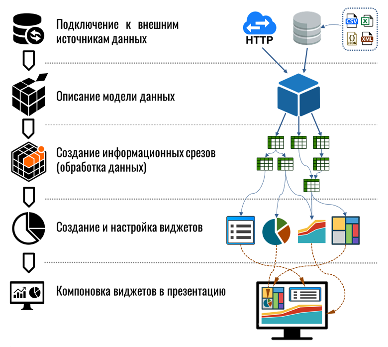
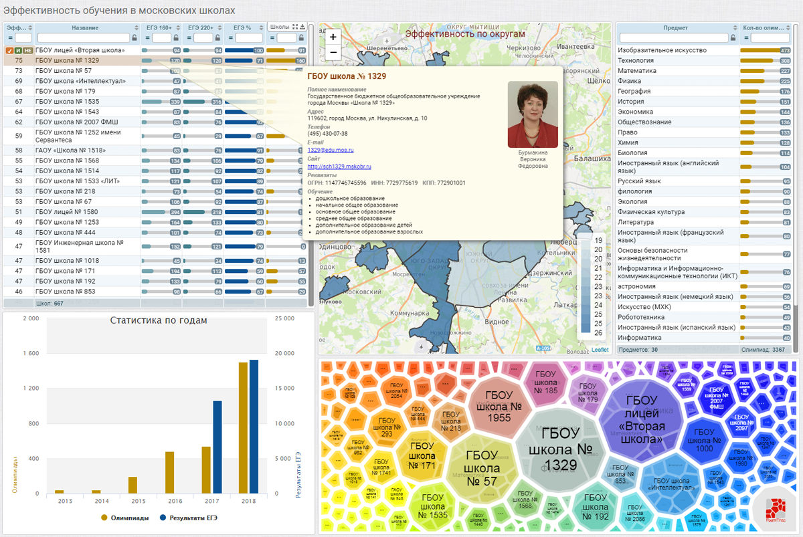
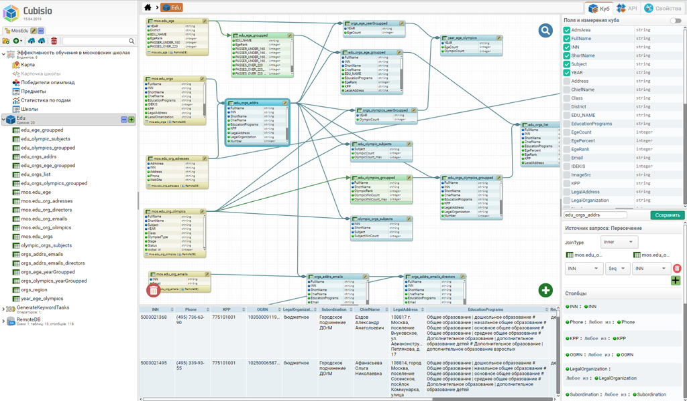
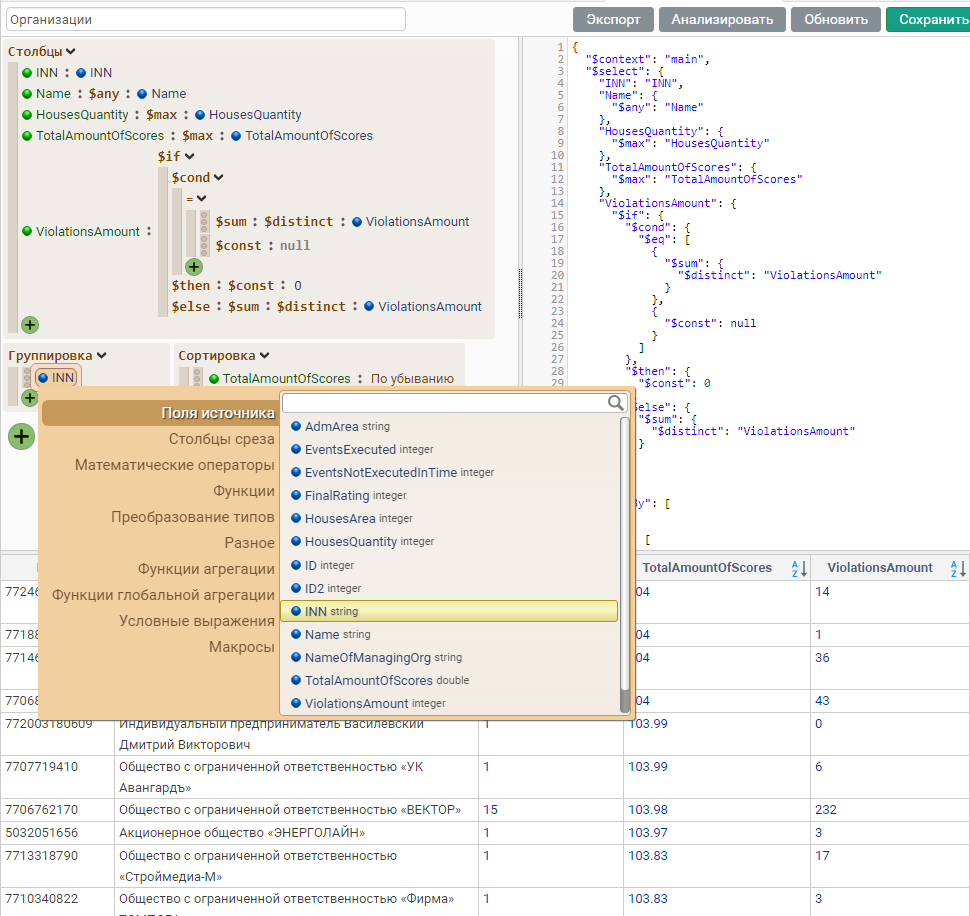
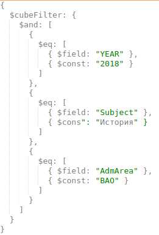
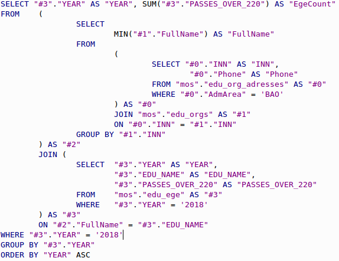

# Виртуальный куб - вместо OLAP

> _Когда делаешь наоборот и получаешь то же ..._

Имея задачу аналитической (вычислительной/агрегирующей) обработки данных приходится искать копромисс между отзывчивостью, скоростью и удобством. 

Одни системы хорошо индексируют и находят, другие умеют быстро рассчитывать и агрегировать данные, третьи просты. Где-то приходится организовывать предварительную загрузку и индексирование данных со всеми сопутствующими трудностями, а где-то пользователю предоставляется абстракция его модели исходных и агрегированных данных поверх встроенных или внешних физических хранилищ и баз данных, используемых непосредственно во время вычислений. В любом случае, пользователь, от программиста до аналитика, должен проделать относительно большую работу, начиная с подготовки сырых данных и составления запросов, модели вычислений, заканчивая визуальным оформлением результата на виджетах, конечно же "Sexy" - красивых, отзывчивых и понятных, - иначе вся проделанная работа пойдет насмарку. И часто, как назло, пройдя через муки выбора решения, мы замечаем, как простая и понятная на первый взгляд задача вырастает в жуткого монстра, с которым имеющимися средствами бороться бесполезно, и надо срочно что-то изобретать - велосипед, но "с блэкджеком и шлюхами". Наш велосипед поехал, даже неплохо объезжает кочки и справляется с препятствиями, о которых раньше можно было только гадать. 

Ниже будет описана одна сторона оригинального внутреннего устройства "Кубика-Рубика" - вычислительная обработка для интерактивной визуализации данных. 

> _Простая задача должна решаться просто, а сложная - тоже просто, но дольше ..._
>

Начиная создавать систему малыми силами, мы пошли от простого к сложному. Создавая конструктор, мы были внутренне убеждены, что мы хорошо понимаем цель системы, борясь одновременно с желанием не делать лишнего и противоположным желанием автоматизировать всё и вся, для всего создавая фреймворк. Тем более, что один наш замечательный фреймворк был уже готов и даже обкатан в продакшене - jsBeans. Итак, мы приступили к разработке очередной системы обработки данных, которая выросла и сейчас представляет собой одновременно и самодостаточный продукт - конструктор, и платформу для разработки целого класса систем обработки данных - условно будем называть ее "Кубик-Рубика", чтобы обойтись без рекламы.

## Куб, срез, измерение

Основная задача - имея наборы несвязанных данных, включая разнородные внешние базы данных и файлы, сформировать многомерную модель из связанных между собой элементов исходных данных и результатов их аналитической обработки для визуализации на динамических дашбордах и взаимосвязанных виджетах. 

Проще говоря, например, так:

_Рис 1. Пример кликабельного дашборда_

Такая многомерная модель данных в нашей системе называется "Куб" и буквально представляет собой абстрактную коллекцию изменяемых наборов данных, называемых "Срез", связанных между собой общими выходными (отображаемыми) полями/столбцами или внутренними полями, называемыми "Измерения" и используемыми для фильтрации и связывания срезов между собой. 

Срез можно представить как виртульную таблицу или вью (CTE) с параметрами и изменяемым телом запроса, в зависимости от условий фильтрации. Главное, чтобы выходные данные изменялись, в зависимости от условий контекстного поиска (внутри виджета) и глобального фильтра, который строится выбором значений на виджетах и применением базовых логический функций (И/ИЛИ/НЕ) и комбинаций.

Глобальный фильтр позволяет "вращать Кубик-Рубика", как-то так:

<video loop="" preload="none" autoplay=""><source src="http://cdn.cubisio.online/heading.mp4" type="video/mp4"></video>

_Рис 2. Пример простейшего взаимодействия виджетов_

Если выходное поле среза одновременно является измерением в другом срезе, имеет такое же название, то значения этого поля воспринимаются системой как "факты" (если бы мы говорили про OLAP), заданные в форме глобального фильтра, изменяющего исходные наборы данных во время вычислений и агрегации.  Как следствие возникает динамика взаимодействия виджетов, при которой значения отображаемых показателей зависят от выбранных элементов и фильтров.

Срез представляет собой изменяемый "по измерениям" набор данных - исходных или результатов аналитических вычислений; характеризуется выходными полями/столбцами, перечнем поддерживаемых измерений и набором параметров со значениями по-умолчанию; описывается относительно элегантным запросом в визуальном редакторе, поддерживающем фильтрацию, сортировку, группировку/агрегацию, пересечения (JOIN), объединения (UNION), рекурсию и другие манипуляции.

Срезы, использующие друг друга как источники, описывают внутренную структуру куба, например, такую:

_Рис 3. Структура срезов куба "Московские школы"_

Пример среза в редакторе:

_Рис 4. Срез "Олимпиады по возрастам и годам"_

Срез поддерживает как явно заданные в выходных полях измерения, так и наследует измерения от источников запроса - это означает, что выходные данные среза могут быть изменены даже в следствии изменения в других срезах-источниках. Другми словами, результаты среза могут быть отфильтрованы не только по выходным полям, но и по внутренним полям-измерениям источников, где-то в глубине запроса, вплоть до первичных таблиц БД. 

Структура запроса разворачивается и изменяется системой автоматически в момент выполнения, в зависимости от актуального глобального фильтра и входных параметров, протаскивая их вглубь запроса согласно модели куба, объявленных измерений и срезов.

Пример простого глобального фильтра, буквально, когда пользователь зафиксировал или выбрал значения на нескольких виджетах:

_Рис 5 Глобальный фильтр "Год, Предмет, Округ"_

_Рис 6. JSON глобального фильтра "Год, Предмет, Округ"_

К первичному источнику (в базу данных) запрос приходит уже в подготовленном виде, пройдя несколько основных этапов:

- Сборка запроса, включая подбор и встраивание оптимальных срезов, с учетом текущего глобального фильтра (когда фильтр отсуствует или простой, можно выбрать простые/быстрые срезы; когда фильтр сложный  - срезы со сложной структурой и дополнительными измерениями);
- Встраивание глобального фильтра и добавление фильтров в тела запросов и подзапросов;
- Встраивание макросов и шаблонных выражений запросов;
- Оптимизация запроса, включая удаление неиспользуемых полей и выражений;
- Дополнительные операции с запросом под специфику первичных баз данных (например, если речь про SQL и в БД остутствует WITH, то именованные запросы встраиваются).

И финальный этап - трансляция запроса к формату первичного источника, например в SQL:

_Рис 7. Тело сгенерированного SQL запроса с глобальным фильтром_

## Когда источники разные

Как правило, все просто и понятно, когда приходится работать с единственным хранилищем данных. Но, когда их несколько и они принципиально разные - приходится применять разные трюки под каждую конкретную задачу. И всегда хочется иметь универсальное решение, которое бы подходило всегда, желательно "из коробки", как максимум с небольшими доработками. Для этого напрашивается еще одна абстракция - над хранилищами данных, во-первых, реализующая согласование форматов и языков запросов, во-вторых, обеспечивающая взаимозависимость данных, хотя бы на уровне дополнительных условий фильтрации в запросах к одному источнику по значениям из другого.

Для этого мы разработали универсальный язык запросов, подходящий и для представления виртуальной модели данных куба, и для работы с условно-произвольными хранилищами засчет трансляции запроса к нужному формату и языку. По удачному стечению обстоятельств, язык запросов, изначально предназначенный для простого маппирования и фильтрации данных из разных источников, с легкостью разросся в полноценный язык поиска и обработки данных, позволяющий строить вычислительные конструкции от самых простых до очень сложных в несколько страниц и с множеством подзапросов.

Источники можно разделить на три типа:

1. файлы с данными, требующие загрузки в систему;
2. базы данных, поддерживающие полноценную обработку данных и другие операции;
3. хранилища, поддерживающие только извлечение данных с фильтрацией или без, включая разного рода внешние сервисы.

С первым типом все однозначно - в системе интегрирован модуль импорта, который парсит различные входные форматы и погружает результаты в хранилище. Для импорта также разработан специальный конструктор, о котором стоит рассказать отдельно. 

Второй тип - самодостаточные базы данных, для работы с которыми требуется лишь транслировать исходный запрос к нужному формату и языку запроса, диалекту. 

Третий же тип требует как минимум пост-обработки данных. И все типы при одновременном использовании также могут потребовать пост-обработки - пересечения, объединения, агрегацию и финальные вычисления.  Это происходит, когда обработку данных в одной базе данных нужно выполнить с учетом результатов фильтрации в другой внешней.

_Самый простой пример, когда нечеткий поиск выполняется в одной БД, а на выходе надо получить агрегацию показателей, сохраненных в другой БД на другом сервере, с учетом результатов поиска._

Для реализации работы такой схемы в нашей системе реализован нехитрый алгоритм, при котором один исходный запрос одновременно подготавливается несколькими интерпретаторами, каждый из которых может либо отказаться от выполнения запроса при его несовместимости, либо вернуть итератор с данными, либо преобразовать запрос и инициировать работу следующей цепочки подготовки запроса другим интерпретатором. В конечном итоге для одного запроса мы получаем от одного до нескольких ленивых итераторов, формирующих один и тот же результат, но разными способами, из которых выбирается лучший (по различным критериям, определенным разработчиком в конфигурации). 

Стратегия выбора итератора задается в конфигурации или параметрах запроса. В настоящий момент поддерживается несколько основных стратегий:

- первый, любой, последний;
- по приоритету типа БД;
- по приоритету цепочeк, сформировавших итераторы;
- по весовой функции "взвешивания запроса";
- по первому результату - производится параллельный запуск всех итераторов и ожидается первый результат, в итоге используется самый быстрый итератор, остальные закрываются.

В результате такой комбинации для одного входного запроса мы получаем несколько вариантов его исполнения, как с использованием разных источников, так и с разными стратегиями выполнения - выбором основной/целевой базы данных, в которой будет выполняться главная часть запроса и финальная сборка результатов.

Если целевая БД поддерживает подключение внешних источников, то становится возможным создание обратного замыкания, при котором БД подключается к API системы для получения небольших оъемов данных из системы, например для фильтрации больших "на месте". Такая интеграция является прозрачной для пользователя - модель куба не меняется, а все операции выполняются системой автоматически. 

<<Вот тут бы схему User -> Cubisio -> DB ( +loopbac+ext DB)>>

Для более сложных случаев в системе реализован внутренний in-memory  интерпретатор запросов на базе H2 Embedded, который позволяет "из коробки" интегрировать между собой любые поддерживаемые базы данных. Буквально, работает это так - запрос разбивается на куски по группам источников, отправляется на выполнение, после чего производится сборка и финальная обработка результатов в памяти движком H2.

Такая схема интеграции данных на уровне внутреннего интерпретатора на первый взгляд кажется "тяжелой", и это правда, если приходится работать с большими объемами входных данных и необходимостью производить вычисления уже после пересечений и объединений наборов из внешних источников. В действительности это обстоятельство частично нивелируется - одновременно запрос выполняется несколькими обработчиками в разных вариантах, следовательно интерпретатор используется только в самых крайних случаях, как универсальное решение "из коробки". В конечном итоге любая интеграция ограничена типичными транспортными издержками на подготовку, передачу по сети и прием данных, а это уже совсем другая задача.

## Техническая сторона

С технической стороны, без которой, наверное, нельзя обойтись, затрагивая данную тему, система так же устроена по принципу - наворотить побольше, но максимально всё упростить.

Система обработки данных реализована поверх клиент-серверного фреймворка jsBeans, как набор дополнительных модулей и специфичных сборочных проектов. jsBeans в свою очередь реализован на Java, работает как сервер приложений, по большому счету является связкой Rhino, Jetty и Akka, а также включает разработанную нашей командой технологию клиент-серверных бинов, и богатую библиотеку компонент. 

Кубик рубика целиком и полностью реализован на JavaScript в виде множества js-бинов (*.jsb файлов), часть из которых функционируют только на сервере, другая часть на клиенте, а остальные представляют собой составной компонент, функционирующий как распределенное целое, части которого взаимодействуют между собой, прозрачно для разработчика, но под его контролем. Jsb-бины могут иметь разную жизненную стратегию, например, с привязкой или без к сесии пользвоателя. Бин является изоморфным, позволяет и на клиенте, и на сервере работать как с виртуальным экземпляром обычного класса. Бин описывается одним файлом и включает три секции - для полей методов, выполяющихся на клиенте, для серверных, и секция общих синхронизируемых полей.

Так как статья уже получилась многословной, чтобы не утомлять читателя, пора перейти к завершению, с намерением вскоре описать самые интересные архитектурные решения в реализаци JsBeans и наших проектах на его основе.

## Почему так?

_Никогда такого не было, и вот опять..._

По-началу, первичных наборов данных было мало. Предметные области и задачи были вполне конкретизированы. Казалось бы, зачем такие мучения? Задача выглядела просто, всем хотелось получить результат сразу - особенно, когда быстрое решение лежало на поверхости, а правильное требовало усидчивости и взвешенных решений, соблюдения изначальной установки. Мы шли в обратном направлении, от сложных и долгих решений к простым и быстрым, по пути обобщения частных задач.

Главное условие - новые дашборды должны строиться быстро, даже если новая предметная область и аналитические потребности сильно отличаются от предыдущих. Заведомо не угадаешь и половины будущих требований, система должна быть в первую очередь податливой. Доработка библиотеки компонент, аналитических алгоритмов, подключение новых типов источников - неотемлемая часть адаптации системы. Другими словами, связка заработала - аналитики строят запросы и дашборды, а программисты оперативно реализуют для них новые потребности. И мы, как программисты, стремились упростить работу себе в будущем, стараясь не навредить юзабилити.

 И система сразу создавалась универсальной и адаптивной - мы строили "конструктор конструктором", разрабатывая фреймворк поверх фреймворка, ранее созданного с похожей но еще более общей целью. 

**условный Кубик-Рубика** - ... Кубик-Рубика разрабатывается как ответвление и логичное продолжение jsBeans.

**jsBeans** -  ...наша клиент-серверная платформа, которая очень хорошо вписывается в лежащие перед нами задачи ..

_В зависимости от реакции и предпочтений читателя, и решения модератора, в следующих статьях мы с радостью раскроем другие стороны некоторых интересных архитектурных решений нашей команды - конструируемую подсистему визуализации, аналитические процессы, онтологический конструктор предметных областей, язык запросов, импорт данных и что-то еще..._

