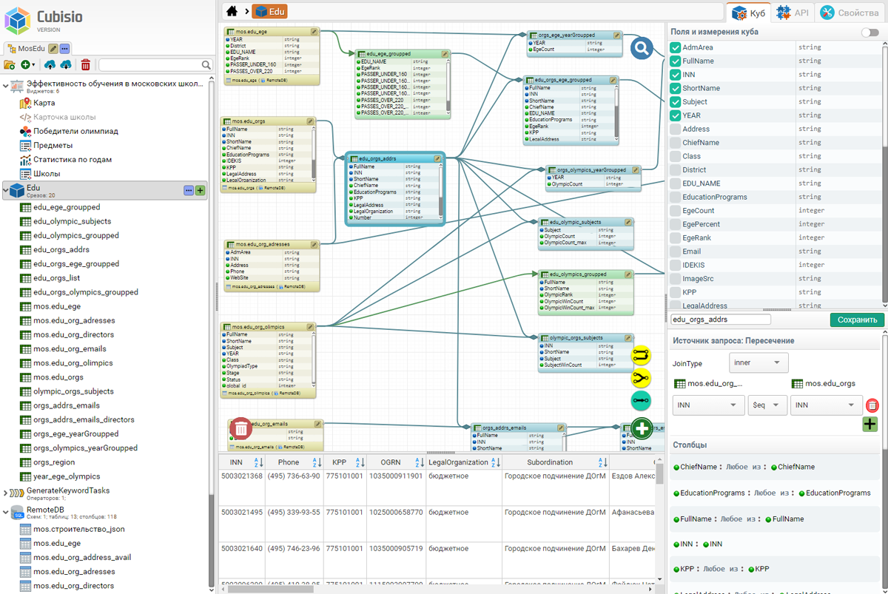
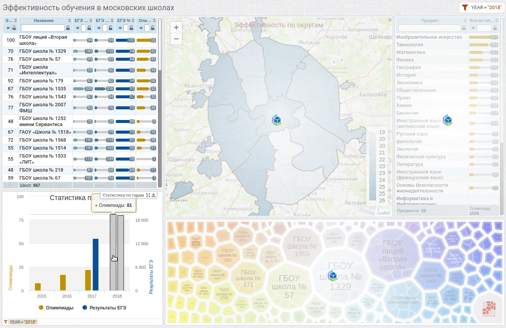

# Виртуальный куб Qubisio - вместо OLAP

##  Абстрактно

_Когда делаешь наоборот и получаешь то же ..._

Имея задачу аналитической (вычислительной/агрегирующей) обработки данных приходится искать копромисс между отзывчивостью, скоростью и удобством. 

Одни системы хорошо индексируют и находят, другие быстро считают и агрегируют данные, третьи просты. Где-то приходится организовывать предварительную загрузку и индексирование данных со всеми сопутствующими трудностями, а где-то пользователю предоставляется абстракция его модели исходных и агрегированных данных поверх встроенных или внешних физических хранилищ и баз данных, используемых непосредственно во время вычислений. В любом случае, пользователь, от программиста до аналитика, должен проделать относительно большую работу, начиная с подготовки сырых данных и составления запросов, модели вычислений, заканчивая визуальным оформлением результата на виджетах, конечно же "Sexy" - красивых, отзывчивых и понятных, - иначе в конце вся проделанная работа пойдет насмарку. И часто, как назло, пройдя муки выбора решения, мы замечаем, как простая и понятная на первый взгляд задача вырастает в жуткого монстра, с которым имеющимися средставами бороться бесполезно, и надо срочно что-то изобретать - велосипед, но "с блэкджеком и шлюхами". Наш велосипед поехал, даже неплохо объезжает кочки и справляется с препятствиями, о которых раньше можно было только гадать. 

_Простая задача должна решаться просто, а сложная - тоже просто, но дольше ..._

Начиная создавать систему малыми силами, мы пошли от простого к сложному. Создавая конструктор, мы были внутренне убеждены, что мы хорошо понимаем цель системы, борясь одновременно с желанием не делать лишнего и противоположным желанием автоматизировать всё и вся, для всего создавая фреймворк. Тем более, что один замечательный фреймворк был уже готов и даже обкатан в продакшене (**jsBeans** - наша клиент-серверная платформа, которая очень хорошо вписывается в лежащие перед нами задачи). Итак, мы приступили к разработке очередной системы обработки данных, которая выросла и сейчас представляет из себя одновременно и самодостаточный продукт - конструктор, и платформу разработки целого класса систем обработки данных - **Qubisio**. 

Ниже будет описана одна сторона оригинального внутреннего устройства этой системы - вычислительная обработка для интерактивной визуализации данных. 

## Введение - куб, срез, измерение

$$$ Тут надо другое введение в ключевой принцип

Главный принцип - имея наборы несвязанных данных, включая разнородные внешние БД, сформировать многомерную модель из связанных между собой элементов исходных данных и результатов их аналитической обработки для визуализации на динамических дашбордах и взаимосвязанных виджетах.

_Пример дашборда_

Такая модель в нашей системе называется "Куб" и буквально представляет собой абстрактную коллекцию изменяемых наборов данных, называемых "Срез", связанных между собой общими выходными (отображаемыми) полями/столбцами или внутренними полями, называемыми "Измерения" и используемыми для фильтрации и связывания срезов между собой. 

_Пример модели данных куба_

Если выходное поле среза одновременно является измерением в другом срезе, имеет такое же название, то значения этого поля воспринимаются системой как "факты" (если бы мы говорили про OLAP), заданные в форме глобального фильтра, изменяющего исходные наборы данных во время вычислений и агрегации.  Как следствие возникает динамика взаимодействия виджетов, при которой значения отображаемых показателей зависят от выбранных элементов и фильтров.

_Рис 1. Пример простейшего взаимодействия виджетов_

Срез представляет собой изменяемый "по измерениям" набор данных - исходных или результатов аналитических вычислений; характеризуется выходными полями/столбцами, перечнем поддерживаемых измерений и набором параметров со значениями по-умолчанию; описывается относительно элегантным запросом в визуальном редакторе, поддерживающем фильтрацию, сортировку, группировку/агрегацию, пересечения (JOIN), объединения (UNION), рекурсию и другие манипуляции.

_Рис 2. Пример запроса у среза_

Срез поддерживает как явно заданные в выходных полях измерения, так и наследует измерения от источников запроса - это означает, что выходные данные среза могут быть изменены согласно глобальному фильтру, включающему поддерживаемые срезом измерения, значения, условия и выражения. Другми словами, результаты среза могут быть отфильтрованы не только по выходным полям, но и по внутренним полям-измерениям источников, где-то в глубине запроса, вплоть до первичных таблиц БД. Структура запроса разворачивается и изменяется системой автоматически в момент выполнения, в зависимости от актуального глобального фильтра и входных параметров, протаскивая их вглубь запроса согласно модели куба, объявленных измерений и срезов.

_Рис 3. Пример глобального фильтра на дашборде_

_Рис 4. Пример JSON глобального фильтра_

_Рис 5. Пример финального SQL запроса со встроенным фильтром_

## Когда источники разные

Как правило, все просто и понятно, когда приходится работать с единственным хранилищем данных. Когда их несколько и они принципиально разные - приходится применять разные трюки под каждую конкретную задачу. И всегда хочется иметь универсальное решение, которое бы подходило всегда, желательно "из коробки", как максимум с небольшими доработками. Для этого напрашивается еще одна абстракция - над хранилищами данных, во-первых, реализующая согласование форматов и языков запросов, во-вторых, обеспечивающая взаимозависимость данных, хотя бы на уровне дополнительных условий фильтрации в запросах к одному источнику по значениям из другого.

Для этого мы разработали универсальный язык запросов, подходящий и для представления виртуальной модели данных куба, и для работы с условно-произвольными хранилищами засчет автоматического преобразования запроса к нужному формату и языку. По удачному стечению обстоятельств, язык запросов, изначально предназначенный для простого маппирования и фильтрации данных из разных источников, с легкостью разросся в полноценный язык поиска и обработки данных, позволяющий строить вычислительные конструкции от самых простых до сложных в несколько страниц и множеством подзапросов.

<<Схема Query -> Engine -> (SQL+JDBC (PostgreSQL, ClickHouse, H2), Mongodb, HTTP Rest API) >>

Условно все источники можно разделить на три типа:

1. файлы с данными, требующие загрузки в систему;
2. базы данных, поддерживающие полноценную обработку данных и другие операции;
3. хранилища, поддерживающие только извлечение данных с фильтрацией или без.

С первым типом все однозначно - в системе интегрирован модуль импорта, который парсит различные входные форматы и погружает результаты в хранилище. Второй тип - самодостаточные базы данных, для работы с которыми требуется лишь транслировать исходный запрос к нужному формату и языку запроса. Третий же тип требует как минимум пост-обработки данных. И все типы при одновременном использовании так же чаще всего требуют пост-обработки, пересечения, объединения, и часто только в конце выполняется агрегация и финальные вычисления. 

_Самый простой пример, когда полностекстовый поиск выполняется в одной БД, а на выходе надо получить агрегацию показателей, сохраненных в другой БД на другом сервере._

Для реализации работы такой схемы в нашей системе реализован не хитрый алгоритм, при котором один исходный запрос одновременно подготавливается несколькими обработчиками, каждый из которых может либо отказаться от выполнения запроса при его несовместимости, либо вернуть итератор с данными, либо преобразовать запрос и инициировать работу следующей цепочки подготовки запроса другим движком. В конечном итоге для одного запроса мы получаем от одного до нескольких ленивых итераторов, формирующих один и тот же результат, но разными способами, из которых выбирается лучший (по различным критериям, определенным разработчиком в конфигурации). 

Для формирования такой цепочки подготовки запроса оказалось достаточным всего три типа конфигурируемых обработчиков:

1. трансформер, выполняющий предварительную трансформацию и оптимизацию запроса;
2. транслятор, выполняющий преобразование запроса к языку запросов целевой БД и формирующий итератор с данными;
3. внутренний интерпретатор - движок, выполняющий обработку данных, полученных напрямую из источников (на базе embedded H2).

<<Нарисовать бы схему подготовки запроса Assembly->prepare->(SQL,Mongo,Interpretator)>>

Схема интеграции данных на уровне внутреннего интерпретатора на первый взгляд кажется вычислительно тяжелой, и это правда, если работать приходится с большими объемами входных данных и необходимостью производить вычисления уже после пересечений и объединений наборов из внешних источников. Но т.к. одновременно запрос выполняется несколькими обработчиками, то интерпретатор используется только в крайних случаях, когда источники "из коробки" не поддерживают запрос целиком и его не удается разбить на части.  Так же эта проблема в рамках описанной выше парадигмы частично решается еще одним способом.

Если целевая БД поддерживает подключение внешних источников, то становится возможным создания обратного замыкания, при котором БД подключается к API системы для получения небольших оъемов данных из системы, например для фильтрации больших "на месте". Такая интеграция является прозрачной для пользователя - модель куба не меняется, а все операции выполняются системой автоматически.

<<Схема-кольцо Qubisio -(запрос)-> DB -(подзапрос)-> Qubisio -(промеж.данные)-> DB -(результат)-> Qubisio>>

<<Пример запроса к двум разным БД через внутренний интерпретатор>>

<<Пример интеграции с Clickhouse в качестве целевой БД>>

